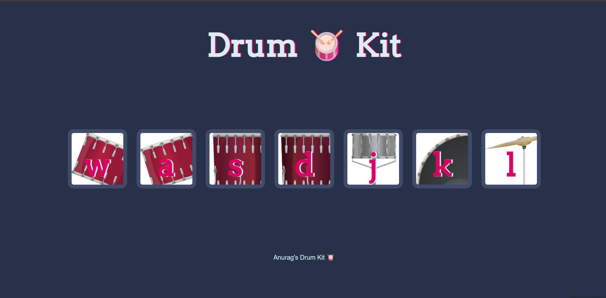

# Drum Kit

This is a simple interactive drum kit built for the web. You can play different drum sounds by clicking on the drum pads or pressing the corresponding keys on your keyboard.

## Live Demo

[https://anurag2118.github.io/Drum-Kit/](https://anurag2118.github.io/Drum-Kit/)

## Screenshot


## How to Play

* **Click the drum pads:** Each pad represents a different drum sound.
* **Use your keyboard:** Press the keys 'w', 'a', 's', 'd', 'j', 'k', 'l' to trigger specific drum sounds.

## Features

* **Interactive Design:** Clickable drum pads that respond to user input.
* **Keyboard Support:** Play drums using your keyboard for a more dynamic experience.
* **Sound Feedback:** Each drum pad and key press plays an authentic drum sound.
* **Visual Feedback:** Buttons animate briefly when pressed or clicked.

## Technologies Used

* HTML5
* CSS3
* JavaScript

## Getting Started

To get a local copy of this project running on your machine:

1.  **Clone the repository:**
    ```bash
    git clone [https://github.com/anurag2118/Drum-Kit.git](https://github.com/anurag2118/Drum-Kit.git)
    ```
2.  **Navigate to the project directory:**
    ```bash
    cd Drum-Kit
    ```
3.  **Open `index.html`** in your web browser.

## Project Link

[https://github.com/anurag2118/Drum-Kit](https://github.com/anurag2118/Drum-Kit)
